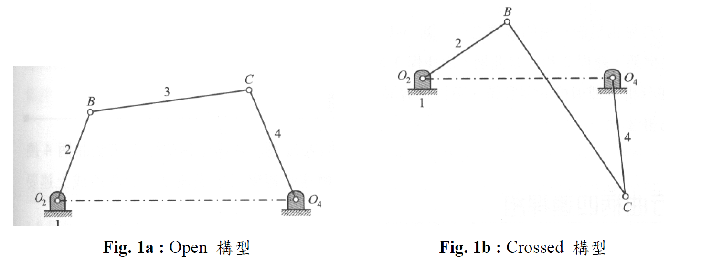

# Four-bar-Linkage-Kinematic-Analysis
Four-bar Linkage Kinematic Analysis Using Dev-C++

## 
讓使用者輸入四支桿件的長度及分析的標的，此標的即指所求的分析結果，例如耦點的運動(位置、速度、加速度等)或輸出桿的運動(角位置、角速度、角加速度等)。

輸入四支桿件的長度後，讓使用者輸入四連桿組的構型(open 或 crossed-type configuration)電腦程式程式必須能判別四連桿組的類型。之後，詢問而讓使用者輸入欲分析的對象：耦點或輸出桿，若是耦點則讓使用者輸入耦點的位置的兩個參數值；若是輸出桿則進入下一步的輸入。之後，讓使用者輸入欲分析的輸入桿運動位置 step increment(每步的增量)、角速度與角加速度。

程式執行將呈現下列結果：  
(1) 四連桿組類型判別：crank-rocker, double crank, double rocker, triple rocker 等   
(2) 輸入桿的運動範圍    
(3) 耦點或輸出桿的的運動分析結果(位置、速度、加速度等)    
(4) 運動分析結果的呈現：monitor 上的呈現(曲線、動態模擬) 與/或自動儲存成一個檔案    

